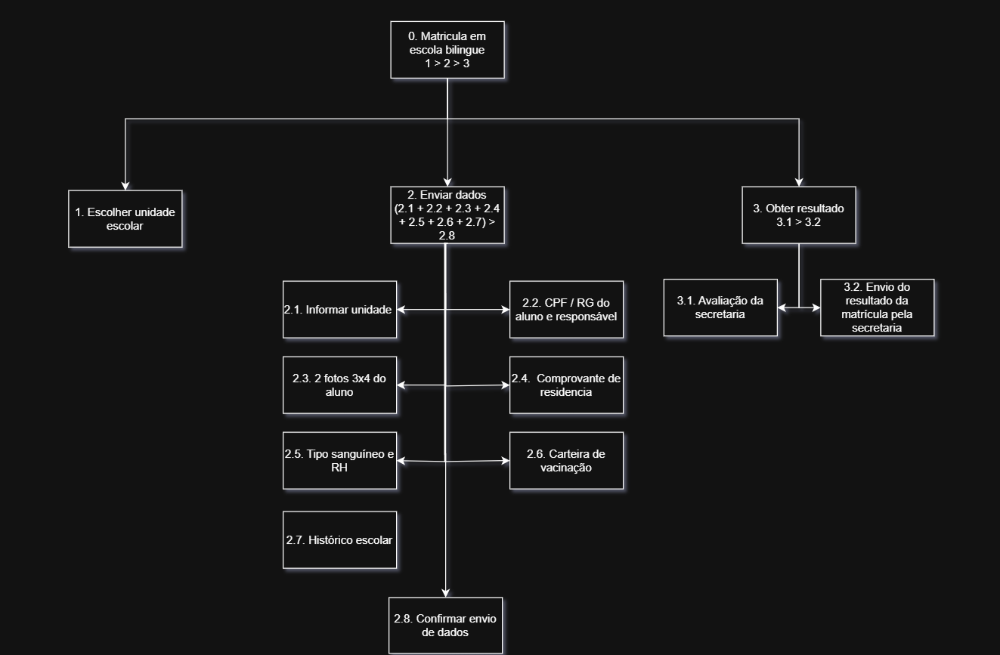
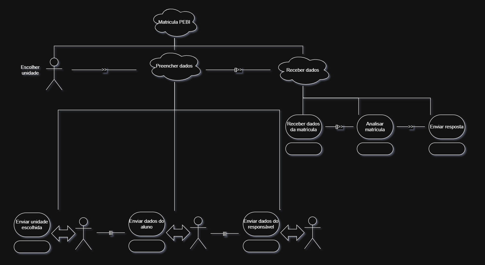

## Análise de tarefas
Para análise de tarefas liguada a funcionalidade de matricula no **Programa de Educação Bilíngue Intercultural (PEBI)** foram escolhidas a **Análise Hierárquica de Tarefas (HTA)** e **Árvore de Tarefas COncorrentes (CTT)**

### Análise Hierárquica de Tarefas (HTA) 

Fonte: [Matheus](https://github.com/matheus-06)

### Árvore de Tarefas Concorrentes (CTT)

Fonte: [Matheus](https://github.com/matheus-06)

---
## Referências Bibliográficas

> <a id="REF1">1.</a> BARBOSA, S. D. J.; SILVA, B. S. da; SILVEIRA, M. S.; GASPARINI, I.; DARIN, T.; BARBOSA, G. D. J. (2021). *Interação Humano-Computador e Experiência do Usuário*. Autopublicação. ISBN: 978-65-00-19677-1.

## Histórico de versão

| Versão | Data       | Descrição | Autor(es)| Revisor(es) |
| ------ | ---------- | ---------------------------------------- | ----------------------------------------------------------------------------------------------- | ----------- |
| `1.0`  | 02/05/2026 | Criação da página                        | [Matheus](https://github.com/matheus-06)||