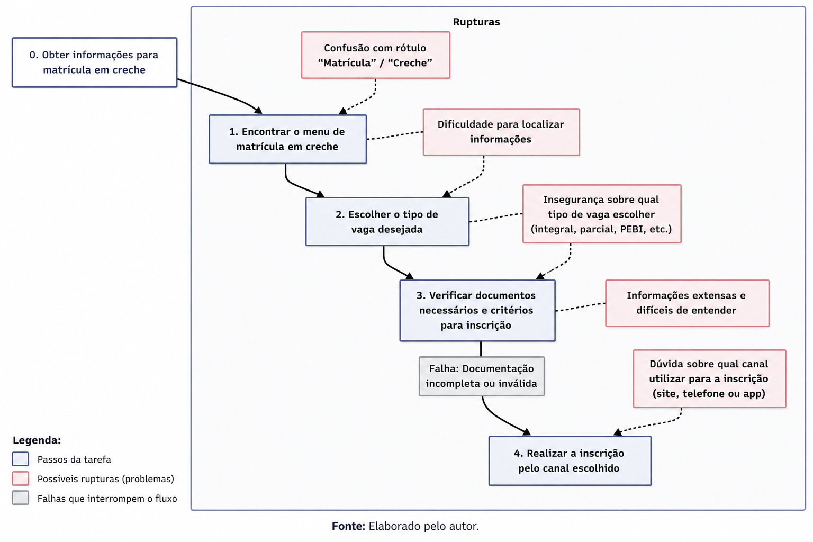

# Análise de Documentação – Matrícula (Creche)

## Introdução

A análise de documentação consiste na avaliação de conteúdos informativos disponibilizados em sistemas digitais, com o objetivo de verificar sua clareza, organização e adequação ao público-alvo. Essa técnica é amplamente utilizada em projetos de Interação Humano-Computador (IHC), especialmente em serviços públicos digitais, onde grande parte da interação ocorre por meio da leitura de instruções e orientações.

Neste contexto, a análise foi aplicada à página de matrícula na categoria creche do site da Secretaria de Estado de Educação do Distrito Federal (SEEDF), visando identificar possíveis dificuldades enfrentadas pelos usuários durante o processo de compreensão das informações.

## Metodologia

Foi utilizada a técnica de revisão de documentação, que permite analisar conteúdos existentes sem a necessidade de interação direta com usuários. Essa abordagem é adequada para sistemas institucionais, nos quais o acesso à informação ocorre predominantemente por meio de textos explicativos.

A escolha dessa metodologia se justifica pela possibilidade de identificar problemas relacionados à clareza, organização da informação e acessibilidade do conteúdo, considerando diferentes perfis de usuários.

## Análise

Durante a análise da página de matrícula na categoria creche, foram identificados aspectos que podem impactar a experiência do usuário.

Observa-se a presença de uma grande quantidade de informações apresentadas simultaneamente, o que pode dificultar a identificação das etapas principais do processo de inscrição. A ausência de uma estrutura clara em formato de passo a passo pode gerar confusão, especialmente para usuários que acessam o sistema pela primeira vez.

Além disso, a página oferece múltiplos canais para realização da inscrição, como telefone, site e aplicativo. Embora essa diversidade amplie o acesso ao serviço, a falta de orientação clara sobre qual canal utilizar pode gerar insegurança no usuário.

Outro ponto relevante refere-se à hierarquia visual da página, que não direciona de forma objetiva o usuário sobre por onde iniciar o processo, dificultando a navegação.

Adicionalmente, a página apresenta forte dependência de conteúdo textual e utiliza linguagem mais formal em alguns trechos. Esse fator pode comprometer a acessibilidade da informação, especialmente para usuários com menor nível de escolaridade ou pouca familiaridade com sistemas digitais.

De acordo com estudos sobre o uso da internet no Brasil, embora a conectividade seja elevada, as habilidades digitais variam conforme o nível de instrução, sendo mais limitadas entre usuários com menor escolaridade²³.

Nesse contexto, a ausência de linguagem simplificada e de recursos visuais pode dificultar o entendimento das instruções e aumentar a probabilidade de erros durante o processo de inscrição.

## Análise de Tarefas (HTA)

A análise hierárquica de tarefas (HTA) foi utilizada para decompor o processo de solicitação de vaga em creche em etapas menores, facilitando a identificação de possíveis dificuldades enfrentadas pelo usuário.

  

<b>Figura X:</b> Diagrama de análise de tarefas para matrícula em creche.

### Objetivo
Solicitar vaga em creche pública.

### Decomposição da tarefa

1. Acessar a página de matrícula  
   1.1 Abrir navegador  
   1.2 Acessar o site da SEEDF  

2. Localizar a opção de creche  
   2.1 Navegar pelo menu  
   2.2 Identificar a categoria correta  

3. Compreender as informações  
   3.1 Ler as instruções disponíveis  
   3.2 Identificar os canais de inscrição  

4. Realizar a inscrição  
   4.1 Escolher canal (telefone, site ou aplicativo)  
   4.2 Seguir as orientações fornecidas  

### Problemas identificados

- Dificuldade na localização das informações  
- Excesso de conteúdo textual  
- Falta de orientação clara sobre o fluxo da tarefa  
## Conclusão

A partir da análise realizada, conclui-se que, embora a página contenha as informações necessárias para a realização da matrícula, a forma como essas informações são apresentadas pode dificultar a experiência do usuário.

Problemas como excesso de conteúdo textual, ausência de orientação clara e linguagem pouco acessível impactam principalmente usuários com menor nível de escolaridade ou pouca familiaridade com tecnologia.

Dessa forma, recomenda-se a reorganização do conteúdo em etapas estruturadas, o uso de linguagem mais simples e a inclusão de elementos visuais que auxiliem na compreensão do processo, tornando o serviço mais acessível e inclusivo.

---

## Referências

¹ SECRETARIA DE ESTADO DE EDUCAÇÃO DO DISTRITO FEDERAL (SEEDF). Serviços de matrícula. Disponível em: https://www.educacao.df.gov.br. Acesso em: 02 mai. 2026.

² MINISTÉRIO DAS COMUNICAÇÕES. Brasil conecta novos usuários à internet. Disponível em: https://www.gov.br/mcom. Acesso em: 02 mai. 2026.

³ CGI.br / CETIC.br. TIC Domicílios 2024. Disponível em: https://www.cgi.br. Acesso em: 02 mai. 2026.

## Histórico de Versões

| Versão | Data       | Descrição              | Autor(es)                                                                 | Revisor(es) |
|--------|------------|------------------------|---------------------------------------------------------------------------|-------------|
| 1.0    | 30/04/2026 | Criação da página      | [Giulia Paulucci](https://github.com/GiuliaPaulucci)                      | -           |
