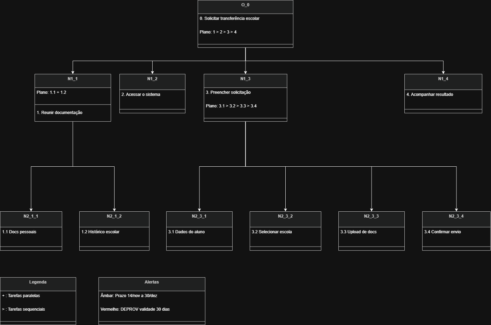

## Análise de Tarefas

## Introdução

A análise de tarefas é uma etapa fundamental no processo de design centrado no usuário, pois permite compreender como os usuários realizam suas atividades e quais os objetivos que buscam alcançar ao interagir com um sistema. Por meio dessa análise, é possível identificar problemas, propor melhorias e fundamentar decisões de design com base no comportamento real dos usuários. Segundo Barbosa e Silva (2021), a análise de tarefas pode ser utilizada tanto para sistemas já existentes quanto para sistemas ainda em desenvolvimento, auxiliando na elicitação de requisitos comportamentais do software.

Para esta funcionalidade foram utilizadas duas técnicas complementares: a Análise Hierárquica de Tarefas (HTA) e o modelo CMN-GOMS.

## Análise Hierárquica de Tarefas (HTA)

A Análise Hierárquica de Tarefas examina os objetivos de alto nível do usuário e os decompõe hierarquicamente em subobjetivos e operações — as ações no nível mais baixo da hierarquia. Essa técnica relaciona o que o usuário faz, os planos (ordem de execução das subtarefas) e as condições de entrada e saída (inputs e feedbacks) de cada etapa [1].

### Diagrama HTA

 

<div style="text-align: center">
<p>Figura 1: Diagrama HTA da funcionalidade de transferência/remanejamento escolar (Fonte: Elaborado pelos autores, 2026).</p>
</div>

**Legenda:**
- `>` — Sequencial: um objetivo deve ser atingido antes do próximo.
- `+` — Paralelo: objetivos podem ser atingidos ao mesmo tempo ou em qualquer ordem.

### Representação em Tabela

<center>

**Tabela 1 – Análise HTA da funcionalidade de transferência escolar**

| Objetivos / Operações | Problemas e Recomendações |
|---|---|
| **0. Solicitar transferência/remanejamento escolar** <br> *Input:* Necessidade de mudança de escola ou modalidade (ex: Ensino Regular para EJA). <br> *Feedback:* Mensagem de confirmação e, posteriormente, exibição do resultado. <br> *Plano:* 1 > 2 > 3 > 4 | **Problema:** O processo de remanejamento possui prazos muito rígidos (ex: até 14 de novembro). <br> **Recomendação:** O sistema deve exibir a data limite em destaque logo na tela inicial (Heurística: Prevenção de Erros). |
| **1. Reunir documentação obrigatória** <br> *Plano:* Obter documentos pessoais (1.1) e histórico/DEPROV (1.2) em paralelo. | **Problema:** O documento DEPROV possui validade de apenas 30 dias. <br> **Recomendação:** Ao listar os documentos necessários na interface, exibir um alerta visual em destaque sobre a validade do DEPROV para evitar recusas por documentação vencida. |
| **3. Preencher solicitação de vaga** <br> *Plano:* Informar dados > Selecionar escola > Upload de arquivos > Confirmar envio. | **Problema:** O remanejamento depende da disponibilidade de vaga na unidade desejada. <br> **Recomendação:** Na operação 3.2, o sistema deve indicar previamente se a escola selecionada possui vagas disponíveis. Caso não haja, deve exibir feedback claro garantindo que a vaga na escola atual ou sequencial está assegurada. |
| **4. Acompanhar o resultado** <br> *Operação:* Acessar o site para consultar a lista final de resultados. | **Problema:** O usuário pode esquecer a data de divulgação do resultado (30 de dezembro). <br> **Recomendação:** Na tela de confirmação (3.4), incluir um botão para adicionar um lembrete no calendário do celular ou e-mail do usuário. |

</center>

---

## Modelo CMN-GOMS

O modelo CMN-GOMS descreve as tarefas do usuário dividindo-as em quatro elementos: **Goals** (Objetivos que o usuário deseja atingir), **Operators** (Ações primitivas físicas ou cognitivas executadas pelo usuário), **Methods** (Sequências ordenadas de operadores que levam ao objetivo) e **Selection Rules** (Regras que determinam qual método utilizar diante de condições específicas) [2]. A notação CMN-GOMS representa essas tarefas de forma sequencial, semelhante a um pseudocódigo, tornando explícito o fluxo de interação esperado entre o usuário e o sistema.

```
GOAL 0: REALIZAR_TRANSFERENCIA_ESCOLAR

   GOAL 1: REUNIR_DOCUMENTOS_COMPROBATORIOS
      OP. 1.1: Localizar e digitalizar RG ou Certidão de Nascimento do estudante.
      OP. 1.2: Localizar e digitalizar comprovante de residência atualizado.
      OP. 1.3: Solicitar e digitalizar Declaração de Transferência e Histórico/DEPROV
               (verificar validade: máximo 30 dias).

   GOAL 2: REALIZAR_PEDIDO_NO_SISTEMA_DF

      METHOD 2.A: ACESSAR_E_PREENCHER_DADOS
      (SEL. RULE: O usuário está dentro do prazo limite — antes de 14 de novembro)
         OP. 2.A.1: Acessar o site da Educação DF e clicar no menu
                    "Remanejamento Escolar".
         OP. 2.A.2: Digitar o número de matrícula atual do estudante.
         OP. 2.A.3: Selecionar, em uma lista suspensa (dropdown),
                    a escola pública de destino desejada.
         OP. 2.A.4: Clicar em "Anexar" e realizar o upload do Histórico/DEPROV
                    e dos documentos pessoais obrigatórios.
         OP. 2.A.5: Clicar em "Confirmar Solicitação" e guardar o
                    comprovante de envio.

      METHOD 2.B: PRAZO_ENCERRADO
      (SEL. RULE: A data atual é posterior à definida como limite)
         OP. 2.B.1: Verificar (Operador Perceptivo) a mensagem de encerramento
                    do prazo exibida pelo sistema.
         OP. 2.B.2: Consultar o calendário oficial para o próximo período
                    de remanejamento.

   GOAL 3: CONSULTAR_RESULTADO_DO_REMANEJAMENTO

      METHOD 3.A: ACESSAR_RESULTADO_NO_SITE
      (SEL. RULE: A data atual é posterior à data definida como limite para o resultado)
         OP. 3.A.1: Acessar o site da Educação DF e localizar a seção
                    "Resultados do Remanejamento".
         OP. 3.A.2: Digitar a matrícula do estudante na área de consulta.
         OP. 3.A.3: Visualizar (Operador Perceptivo) a aprovação para a nova
                    escola ou a confirmação de manutenção da vaga na escola
                    de origem.
```

---

## Referências Bibliográficas

> <a id="REF1">1.</a> BARBOSA, S. D. J.; SILVA, B. S. da; SILVEIRA, M. S.; GASPARINI, I.; DARIN, T.; BARBOSA, G. D. J. (2021). *Interação Humano-Computador e Experiência do Usuário*. Autopublicação. ISBN: 978-65-00-19677-1.

> <a id="REF2">2.</a> CARD, S. K.; MORAN, T. P.; NEWELL, A. *The Psychology of Human-Computer Interaction*. Hillsdale: Lawrence Erlbaum Associates, 1983.

> <a id="REF3">3.</a> AGÊNCIA BRASÍLIA. *Termina nesta quinta (14) prazo para solicitar remanejamento escolar na rede pública do DF*. 13 nov. 2024. Disponível em: https://www.agenciabrasilia.df.gov.br/2024/11/13/termina-nesta-quinta-14-prazo-para-solicitar-remanejamento-escolar-na-rede-publica-do-df/. Acesso em: 03 mai. 2026.

> <a id="REF4">4.</a> SECRETARIA DE ESTADO DE EDUCAÇÃO DO DISTRITO FEDERAL (SEEDF). *Remanejamento Escolar para 2024*. Disponível em: https://www.educacao.df.gov.br/remanejamento-escolar-para-2024/. Acesso em: 03 mai. 2026.

## Histórico de versão

| Versão | Data       | Descrição                    | Autor(es)                                    | Revisor(es) |
| ------ | ---------- | ---------------------------- | -------------------------------------------- | ----------- |
| `1.0`  | 03/05/2026 | Criação do documento         | [Ígor Veras](https://github.com/igorvdaniel) |             |
| `1.1`  | 03/05/2026 | Adição do modelo CMN-GOMS    | [Ígor Veras](https://github.com/igorvdaniel) |             |