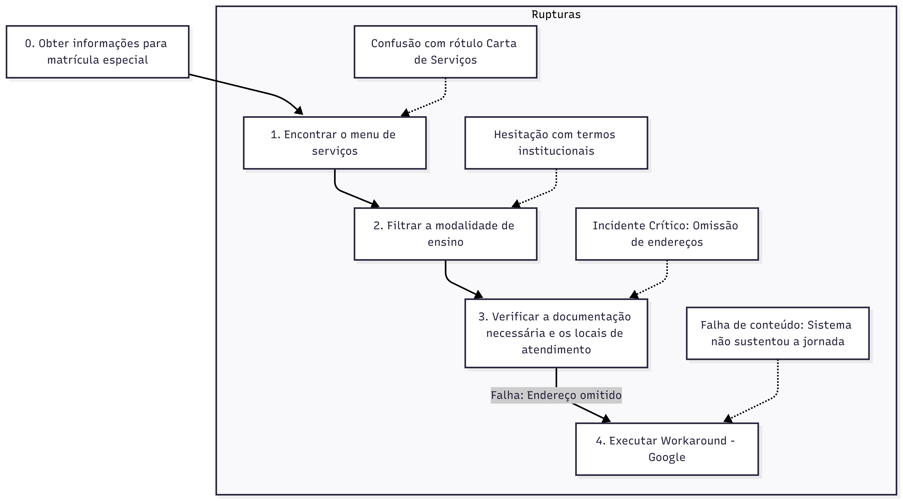

## Introdução

O perfil de usuário consiste em uma descrição detalhada que busca caracterizar quem são as pessoas que podem utilizar o sistema, considerando atributos fundamentais como idade, nível de experiência com tecnologia, atitudes e as tarefas que realizam no cotidiano.Dessa forma, foi aplicado a técnica de entrevista para identificar as necessidades e requisitos do usuário.[1](../../../assets/entrevista/perfil-usuario.png)

Neste projeto acadêmico, a aplicação da técnica e a coleta de dados foram conduzidas de forma **presencial** pela integrante **Luara Cristiana**, que acompanhou a usuária em seu ambiente domiciliar para observar a interação com a tecnologia em uma situação real. A duração da entrevista foi de aproximadamente **20 minutos** e **registrado por video**. 

## Objetivo da Entrevista

 O objetivo da entrevista foi traçar o perfil de uma mãe de criança com autismo para compreender as dificuldades enfrentadas ao navegar pelo serviço de **Ensino Especial** no portal da Secretaria de Educação do Distrito Federal (SEEDF). A intenção foi revelar obstáculos práticos de usabilidade e comunicabilidade que podem impedir a usuária de acessar informações escolares importantes, buscando extrair os requisitos para fundamentar as melhorias no design da plataforma.

## Tópicos abordados na entrevista

Utilizando o livro de IHC como base teórica, a sessão de coleta de dados foi estruturada em quatro fases principais para garantir a integridade dos dados e o conforto da participante:

* **Aspectos Éticos (TCLE):** Antes de qualquer coleta, a participante assinou o Termo de Consentimento Livre e Esclarecido (TCLE), garantindo o respeito à sua autonomia e o anonimato de seus dados e familiares.

[Termo de Consentimento (TCLE)](../../../assets/entrevista/termo-consentiment-assinado.pdf)

* **Entrevista Semiestruturada:** Utilizou-se um roteiro para extrair informações sobre o perfil demográfico, rotina familiar e experiência tecnológica da usuária, permitindo flexibilidade para novos questionamentos durante a conversa.

[Roteiro de Entrevista](../../../assets/entrevista/guia_entrevista.pdf)

* **Investigação do Processo Atual:** Uma conversa detalhada sobre o histórico de matrícula da participante para identificar as etapas reais (laudos, triagens e documentos) e as formas alternativas utilizados para sanar a falta de informação no site.

* **Avaliação por Observação:** Aplicação do protocolo *Think Aloud* (pensar em voz alta), onde a usuária realizou uma tarefa prática no site enquanto narrava seus pensamentos e sentimentos, revelando os obstáculos de usabilidade.[2](../../../assets/entrevista/thinkaloud.png)

## Aspectos Éticos da Pesquisa

A pesquisa iniciou-se apenas após a leitura e assinatura do Termo de Consentimento Livre e Esclarecido (TCLE). A participante foi informada de que a coleta de dados possuía finalidade estritamente acadêmica e de que ela teria o direito de interromper a sessão a qualquer momento, sem necessidade de justificativa, além disso, antes do início da observação prática, foi reforçado à participante que o foco da avaliação era exclusivamente identificar falhas no design do sistema (site da SEEDF), isentando-a de qualquer julgamento sobre suas habilidades tecnológicas. 

Esta abordagem visou evitar a ansiedade e o constrangimento, permitindo um comportamento mais tranquilo durante o uso. A gravação de video, foi mediante a autirização prévia, servindo como ferramenta de apoio à análise. 

## Perfil de usuário

A estrutura do perfil de usuário foi construida a apartir da entrevista, dessa forma: 

### Dados Demográficos e Socioeconômicos

**Identificação:** Mulher, 33 anos, estudante do último semestre de Biomedicina.

**Contexto Familiar:** Mãe e cuidadora principal de três crianças em idade escolar, sendo um dos filhos diagnosticado com autismo (público-alvo direto do serviço de Ensino Especial).

### Rotina e esforço cognitivo

A rotina da participante é marcada por interrupções e atenção dividida. Ela aproveita o período da tarde, enquanto os filhos estão na escola, para dar conta das tarefas de casa e da faculdade. Dessa forma, como ela costuma buscar informações importantes justamente nesses momentos de maior cansaço, o sistema precisa ser muito prático e fácil de usar logo de primeira, sem exigir esforço extra.

### Habilidade Tecnológica

**Preferência de Dispositivo:** Apresenta familiaridade com o uso de smartphones para tarefas rápidas do cotidiano, mas relata preferência pelo **computador** por lhe transmitir maior sensação de segurança ao realizar procedimentos burocráticos ou fornecer dados pessoais.

**Relação com Sistemas Governamentais:** A usuária apresenta uma atitude crítica em relação aos portais do governo. Relatou forte frustração prévia com mecanismos de autenticação (como o GOV.BR), especialmente quando ocorrem falhas no sistema de verificação em duas etapas, criando barreiras de acessibilidade logo no início da jornada.

**Expectativas de uso do sistema**: Ao acessar o portal de Ensino Especial, a usuária espera encontrar informações organizadas e diretas, como lista de documentos, endereços de escolas e contatos telefônicos, sem a necessidade de terminologias técnicas e complexas.

## Análise de Tarefas

A Análise de Tarefas foi conduzida para entender o domínio do problema e investigar como o usuário traduz seus objetivos do "mundo real" (variáveis psicológicas) para os controles oferecidos pelo sistema (variáveis físicas), atravessando os Golfos de Execução e Avaliação descritos pela Engenharia Cognitiva de Norman.[3](../../../assets/entrevista/golfos.png)

Foi utilizada a técnica HTA (Análise Hierárquica de Tarefas) para decompor o objetivo principal da participante em subobjetivos e operações.[4](../../../assets/entrevista/hta.png)

### Descrição do Cenário

**Objetivo exemplo do Usuário:** Localizar a lista de documentos necessários para a matrícula na modalidade de Ensino Especial e encontrar o endereço de uma escola habilitada.

**Representação em Tabela (HTA)**

| Objetivo / Subobjetivo | Descrição da Operação | Notas Observadas (Rupturas) |
| :--- | :--- | :--- |
| **0. Obter informações para matrícula especial** | **Plano 0:** Realizar 1; se a seção for encontrada, realizar 2. Se a informação estiver listada, realizar 3. Caso haja falha na informação, realizar 4. | O objetivo final é reunir informações suficientes para ir à escola presencialmente ou iniciar o processo online. |
| **1. Encontrar o menu de serviços** | O usuário deve localizar o caminho para a área de matrículas no menu principal do site. | **Incidente Crítico:** A participante relatou confusão com o rótulo "Carta de Serviços". Ela procurava explicitamente pela palavra "Matrícula". |
| **2. Filtrar a modalidade de ensino** | Selecionar a opção "Ensino Especial" ou "Educação Precoce". | O uso de nomenclaturas institucionais gerou hesitação (baixa comunicabilidade). |
| **3. Consultar exigências e locais** | Ler a página de resultados para extrair a lista de documentos, endereços e telefones úteis. | A página listava as escolas, mas omitia os endereços e contatos telefônicos. |
| **4. Executar "Workaround" (Gambiarra)** | Abandonar a busca interna no site e recorrer a um motor de busca externo no caso mencionado (Google) para localizar o endereço da escola encontrada no passo 3. | Caracteriza falha de conteúdo relevante. O sistema não sustentou a jornada do usuário até a conclusão da tarefa. |

**Representação em diagrama**

    
    

        <b>Fonte:</b> Elaborado pelo autor.
    

## Avaliação Crítica da Experiência do Usuário

Durante a aplicação do "pensar em voz alta" na entrevista, foram idenficcados os seguintes impactos na Experiência do usuário: 

**Dificuldade no Golfo de execução:** A arquitetura da informação presente no sistema não corresponde a forma como a usuária pensa. O uso de termos ("Carta de Serviços") em vez de termos diretos ("Matrícula do aluno") gerou uma desconexão entre a intenção da usuária e a operação exigida pelo sistema.

**Falha no Golfo de Avaliação:** A ausência de dados práticos (como o telefone e o endereço das escolas nas listagens) impediu que a usuária avaliasse positivamente o estado do sistema. O site informou a existência da escola em locais diferentes, e em outros não informou. de modo geral, falhou em fornecer a utilidade final da informação.

**Sentimento:** A participante definiu sua experiência com a palavra "Confusão". Ao ser questionada sobre sua resiliência na tarefa, afirmou enfaticamente que, se estivesse sozinha em casa, teria desistido do processo digital e procurado outras vias (como telefonar ou ir presencialmente à Regional de Ensino).

## Conclusão Parcial: 

O sistema analisado apresenta barreiras de usabilidade que impactam diretamente a satisfação e a eficiência. A interface exige alto esforço cognitivo para navegação e fornece respostas incompletas, transferindo para o usuário a carga de realizar buscas complementares fora do ambiente do portal.

---

## Entrevista: [Link](https://youtu.be/eCXaVmq1_U8)

---

## Referências Bibliográficas:

> BARBOSA, S. D. J.; SILVA, B. S. da; SILVEIRA, M. S.; GASPARINI, I.; DARIN, T.; BARBOSA, G. D. J. (2021). *Interação Humano-Computador e Experiência do Usuário*. Autopublicação. ISBN: 978-65-00-19677-1.

> DISTRITO FEDERAL. Secretaria de Estado de Educação. Portal da Secretaria de Estado de Educação do Distrito Federal. Brasília, 2026. Disponível em: [https://www.educacao.df.gov.br/](https://www.educacao.df.gov.br/). Acesso em: 03 maio 2026

---

| Versão | Data       | Descrição                                | Autor(es)                                                                                       | Revisor(es) |
| ------ | ---------- | ---------------------------------------- | ----------------------------------------------------------------------------------------------- | ----------- |
| `1.0`  | 03/05/2026 | Criação da página, inserção dos tópicos, links e bibliográfias                      | [Luara Cristiana](https://github.com/luacristiana)                                                   |             |
                                            