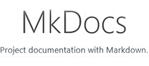
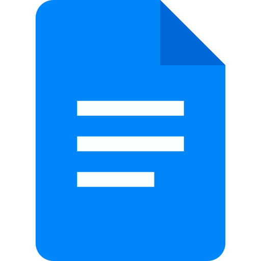
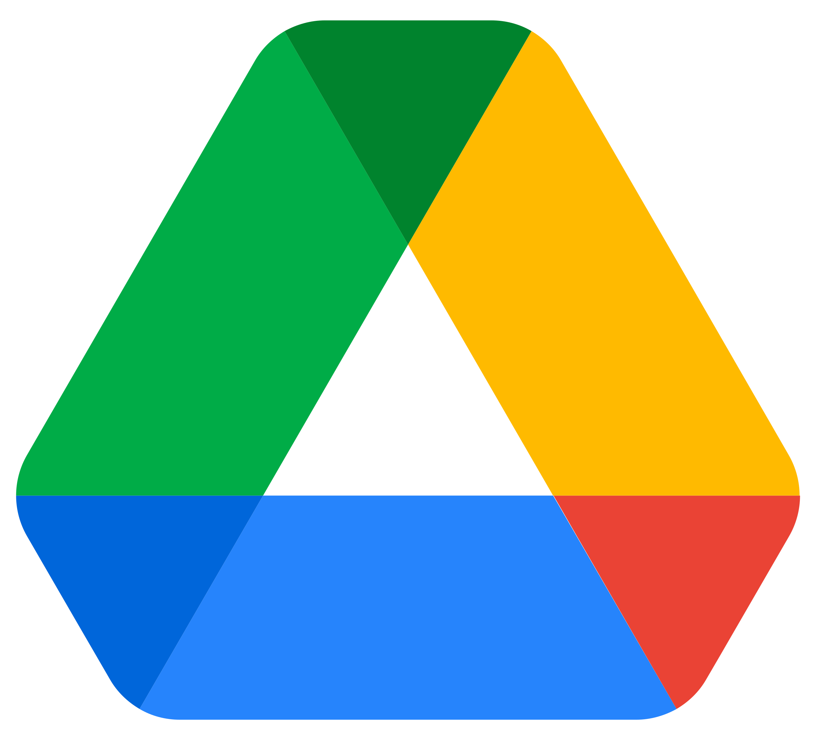

# Ferramentas

## Introdução

&emsp;&emsp;Para a realização do projeto serão utilizadas algumas ferramentas para facilitar a organização da equipe e a produção dos artefatos. As ferramentas escolhidas para a execução do projeto estão apresentadas na Tabela 1.

## Ferramentas Utilizadas

<b>Tabela 1</b> - Ferramentas Utilizadas no Projeto

| Ícone | Ferramenta | Finalidade |
|:-----:|:-----------|:-----------|
|  | GitHub | Organizar, versionar e documentar artefatos produzidos para o projeto.1 |
|  | Microsoft Teams | Realizações de reuniões e gravações de apresentações.2 |
|  | Figma | Produção de artefatos gráficos, modelos e protótipos de baixa e alta fidelidade.3 |
|  | MkDocs | Criação das páginas de documentação.4 |
|  | Visual Studio Code | Edição dos arquivos de documentação.5 |
|  | WhatsApp | Utilizado como principal canal de comunicação.6 |
|  | YouTube | Hospedagem de vídeos produzidos.7 |
|  | Google Planilhas | Criação de planilhas relacionadas ao cronograma e horários.8 |
|  | Google Docs | Criação e edição de tabelas e arquivos.9 |
|  | Google Drive | Compartilhamento de arquivos.10 |
|  | WAVE | Testar acessibilidade de aplicações web.11 |

Fonte: <a href="https://github.com/igorvdaniel">Igor</a>

## Bibliografia

> <a id="FRM1" href="#anchor_1">1.</a> GitHub. Disponível em: [https://docs.github.com/pt](). Acesso em: 10 de abr. de 2026.
>
> <a id="FRM2" href="#anchor_2">2.</a> Microsoft Teams. Disponível em: [https://www.microsoft.com/pt-br/microsoft-teams/group-chat-software](). Acesso em: 10 de abr. de 2026.
>
> <a id="FRM3" href="#anchor_3">3.</a> Figma. Disponível em: [https://www.figma.com/](). Acesso em: 10 de abr. de 2026.
>
> <a id="FRM4" href="#anchor_4">4.</a> MkDocs. Disponível em: [https://www.mkdocs.org/](). Acesso em: 10 de abr. de 2026.
>
> <a id="FRM5" href="#anchor_5">5.</a> Visual Studio Code. Disponível em: [https://code.visualstudio.com/](). Acesso em: 10 de abr. de 2026.
>
> <a id="FRM6" href="#anchor_6">6.</a> WhatsApp. Disponível em: [https://www.whatsapp.com/?lang=pt_br](). Acesso em: 10 de abr. de 2026.
>
> <a id="FRM7" href="#anchor_7">7.</a> YouTube. Disponível em: [https://about.youtube/](). Acesso em: 10 de abr. de 2026.
>
> <a id="FRM8" href="#anchor_8">8.</a> Google Planilhas. Disponível em: [https://www.google.com/intl/pt-BR/sheets/about/](). Acesso em: 10 de abr. de 2026.
>
> <a id="FRM9" href="#anchor_9">9.</a> Google Docs. Disponível em: [https://www.google.com/intl/pt-BR/docs/about/](). Acesso em: 10 de abr. de 2026.
>
> <a id="FRM10" href="#anchor_10">10.</a> Google Drive. Disponível em: [https://workspace.google.com/intl/pt-BR/products/drive/](). Acesso em: 10 de abr. de 2026.
>
> <a id="FRM11" href="#anchor_11">11.</a> WAVE. Disponível em: [https://wave.webaim.org/](). Acesso em: 10 de abr. de 2026.

## Histórico de Versões

| Versão | Data | Descrição | Autor(es) | Revisor(es) |
|--------|------|-----------|-----------|-------------|
| `1.0` | 09/04/2026 | Criação da página de ferramenta | [Ígor Veras](https://github.com/igorvdaniel) | [Matheus Pinheiro](https://github.com/matheus-06) |