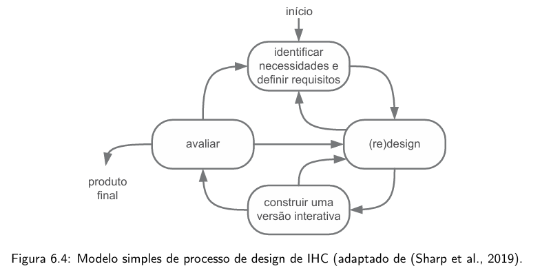
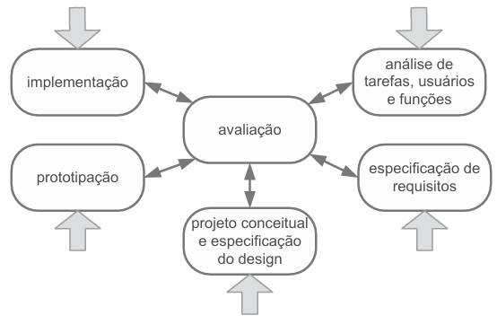
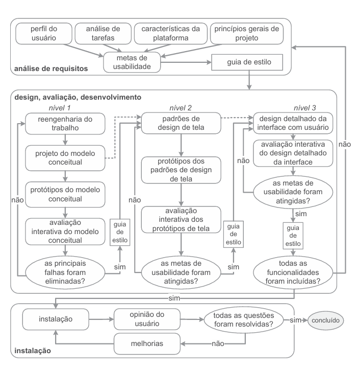

# Processo de Design

## Introdução
Os processos de design de IHC são ciclos iterativos que envolvem três atividades básicas: Análise da situação atual (identificação do problema), síntese de uma intervenção (projeto) e avaliação da intervenção. A iteração permite refinamentos sucessivos, onde o designer aprende mais sobre o problema e a solução a cada ciclo

## Processos

### 1. Processo Simples
- Descrição: É um modelo que organiza o design em quatro etapas básicas: identificar necessidades e definir requisitos, (re)design, construir uma versão interativa e avaliar. É um processo altamente iterativo que foca na criação de protótipos para que o usuário possa participar ativamente da avaliação

- Vantagens: Proporciona agilidade e velocidade, sendo ideal para equipes experientes que já possuem intuição de design consolidada e não precisam de guias prescritivos

- Desvantagens: Pode ser vago para iniciantes, pois a falta de um passo a passo detalhado pode causar duvidas de como realizar cada etapa e dificulta a rastreabilidade

#### Ciclo

### 2. Ciclo de vida Estrela
- Descrição: Este modelo coloca a avaliação como ponto central, conectando as outras cinco atividades: análise de tarefas/usuários, especificação de requisitos, projeto conceitual, prototipação e implementação
- Vantagens: Oferece extrema flexibilidade, permitindo que o designer inicie por qualquer atividade dependendo do estágio de desenvolvimento do artefato. Garante a qualidade contínua, pois exige que cada etapa passe obrigatoriamente pela avaliação central antes continuar

- Desvantagens: A ausência de uma sequência rígida pode ser uma característica negativa para equipes inexperientes, dificultando a escolha de qual caminho seguir

#### Ciclo

### 3. Ciclo de vida para a engenharia de usabilidade (Mayhew)
- Descrição: Propõe uma visão holística, dividida em três fases principais: Análise de requisitos, design, avaliação e desenvolvimento (que é estruturado em três níveis de detalhe: Modelo conceitual, padrões de design e design detalhado) e instalação.

- Vantagens: É um roteiro seguro para iniciantes, oferecendo alto detalhamento de forma a evitar que etapas importantes sejam esquecidas e auxiliando na rastreabilidade. Facilita o gerenciamento da complexidade ao tratar uma parte do problema por vez em diferentes níveis

- Desvantagens: Pode ser percebido como mais lento que os outros devido ao grande número de passos e necessidade de documentação rigorosa

#### Ciclo

## Motivações para a escolha
A escolha pelo modelo de Mayhew justifica-se pelo fato de o grupo ser iniciante no planejamento de avaliação de IHC. A estrutura altamente detalhada e prescritiva de Mayhew ajudará a garantir que a análise de requisitos e as metas de usabilidade sejam verificadas de forma sistemática em três níveis de design, reduzindo o risco de falhas por falta de experiência

## Referências Bibliográficas
> <a id="REF1" href="#anchor_1">1.</a>Barbosa, S. D. J.; Silva, B. S. da; Silveira, M. S.; Gasparini, I.; Darin, T.; Barbosa, G. D. J. (2021)
Interação Humano-Computador e Experiência do usuário. Autopublicação. ISBN: 978-65-00-19677-1

## Histórico de Versão

| Versão |    Data    |                Descrição                 |                    Autor(es)                     |                 Revisor(es)                  |
| ------ | ---------- | ------------------------------------------- | ------------------------------------------------ | ------------------------------------------- |
| `1.0`  | 10/04/2026 | Criação da página de Processo de Design. | [Matheus Pinheiro](https://github.com/matheus-06) | [Ígor Veras](https://github.com/igorvdaniel) |
